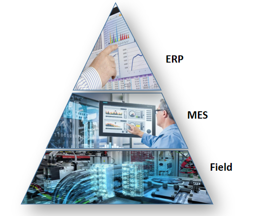
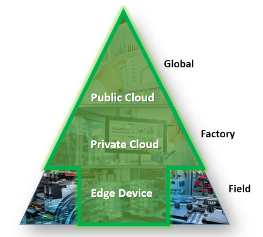

# Recursive Watermark Code Repository
## Description
This project is intended to protect hard real-time channels of Industrial Control Systems with recursive watermark (RWM) methods. In repository includes Matlab-based simulation, an RWM algorithm implementation in C and Matlab, related plots and [the paper in PDF format](RecursiveWatermarkTASE.pdf).

## Abstract
Cybersecurity is of vital importance to industrial control systems (ICSs), such as ship automation, manufacturing, building, and energy automation systems. Many control applications require hard real-time channels, where the delay and jitter are in the levels of milliseconds or less. To the best of our knowledge, no encryption algorithm is fast enough for hard real-time channels of existing industrial fieldbuses and, therefore, made mission-critical applications vulnerable to cyberattacks, e.g., delay and data injection attacks. In this article, we propose a novel recursive watermark (RWM) algorithm for hard real-time control system data integrity validation. Using a watermark key, a transmitter applies watermark noise to hard real-time signals and sends through the unencrypted hard real-time channel. The same key is transferred to the receiver by the encrypted nonreal-time channel. With the same key, the receiver can detect if the data have been modified by the attackers and take action to prevent catastrophic damages. We provide analysis and methods to design proper watermark keys to ensure reliable attack detection. We use a ship propulsion control system for the simulation-based case study, where our algorithm smoothly shuts down the system after attacks. We also evaluated the algorithm speed on a Siemens S7-1500 programmable logic controller (PLC). This hardware experiment demonstrated that the RWM algorithm takes about 2.8 μs to add or validate the watermark noise on one sample data point. As a comparison, common cryptic hashing algorithms can hardly process a small data set under 100 ms. The proposed RWM is about 32 to 1375 times faster than the standard approaches.

## Citation
This page includes supporting materials of the following paper. The code is released under the MIT license. Please cite the paper if you found the code useful. Thanks.

```
Z. Song, A. Skuric. K. Ji, "A Recursive Watermark Method for Hard Real-Time Industrial Control System Cyber-Resilience Enhancement", IEEE Transactions on Automation Science and Engineering, pp 1-14, 2020.
```

In Bibtex format

```
@Article{SongRWM2020,
  author   = {Z. {Song} and A. {Skuric} and K. {Ji}},
  title    = {A Recursive Watermark Method for Hard Real-Time Industrial Control System Cyber-Resilience Enhancement},
  journal  = {IEEE Transactions on Automation Science and Engineering},
  year     = {2020},
  pages    = {1-14},
  issn     = {1558-3783},
  doi      = {10.1109/TASE.2019.2963257},
  url      = {https://github.com/robot007/recursive_watermark}
}
```

## Folder Structure
```bash
├───C                                    # Recursive watermark C code testing implementaiton
│   └─── md5_sample.cpp                  # MD5 sample code
│   └─── sha_sample.cpp                  # SHA sample code
│   └─── watermark_test_functions.c      # RWM sample code
|
├───Matlab                               # RWM testing Matlab code and simulations
    ├───msequence generation             # code for m-sequence generation and primitive polynomial search
    ├───profinet simulation              # Initial comprehensive profinet simulation - not used in paper
    └───propulsion system                # ship propulsion system attack simulation - Used in paper
```

## Acknowledgement
* We'd like to present our sincere appreciation to Dr. A. Canedo, Dr. M. Kang, J. Luo, Dr. R. Craven, Dr. S. Mertoguno, M. Veldink, Dr. P. Kumar, and A. Varró for the in-depth discussions.

* We compared our algorithm with the MD5 and SHA256 implementations from 
http://www.bzflag.org and http://www.zedwood.com/article/cpp-sha256-function. We appreciate the authors for sharing their excellent work.

## Media Report
On Mar 26, 2020, Ms. Michelle Hampson from IEEE Spectrum wrote [a news report on this paper](https://spectrum.ieee.org/tech-talk/telecom/security/new-approach-protects-power-plants-other-major-control-systems-from-hacking) in the Journal Watch column. An offline version is [available here](SpectrumNewsRWM.pdf). 

## Award
The paper won the 2020 best paper award for IEEE Tans. Robotics and Automation 


## Additional Messages to Practitioners
In the automation and control area, the gap between theory and practice is rather large. If you are an engineer, you might have seen some paper with dense math, yet little value to practical projects. This paper is not one of those.
* **The challenge is real**: As seasoned researchers in the automation industry, we want to raise the attention of the industry on the security issues for real-time channels in industrial control systems. This observation is the major motivation of our paper, and it may be related to your project. 
* **The RWM algorithm is rather simple and practical**: We proposed a solution and hope it is useful to you, and we are trying our best to share knowledge so that you can adjust it. Although the math in the paper looks complicated, the algorithm is rather simple, which is demonstrated in the C code. Most of our effort in the paper was used to prove that the method ``works'' (under certain conditions). Most of our code was used for simulation-based testings. The core algorithm is rather short and you may come up with a dozen ideas to adjust it toward your need. (Meanwhile, we are confident that it would not easy to find a faster alternative with guaranteed performance. We spent many weekends and already tried plenty of alternatives. If you find a faster and stable solution, please let us know immediately. That will be great. :-) )
* **The challenge is more than just ship automation systems**: Although we only used the ship automation system as the use case, the challenge is generic, and it is probably more serious when the industrial control system enters the IoT paradigm. The familiar Automation Pyramid to shifting to an IoT age Automation Pyramid, where every field device is exposed to the Internet via edge devices. More efficiency, more advanced analytics, more flexibility, but also more security challenges, especically for the **unencrypted** real-time channels.

<p>
     
    <p>Lef:Traditional Automation Pyramid. Right: IoT Era Automation Pyramid</p>
</p>

## Contacts
* Zhen Song (zhensong@ieee.org)
* Antun Skuric (antun.skuric@outlook.com)
* Kun Ji (kun.ji@siemens.com)
